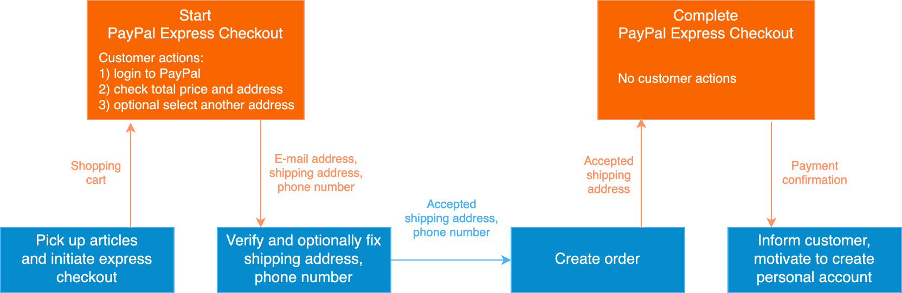
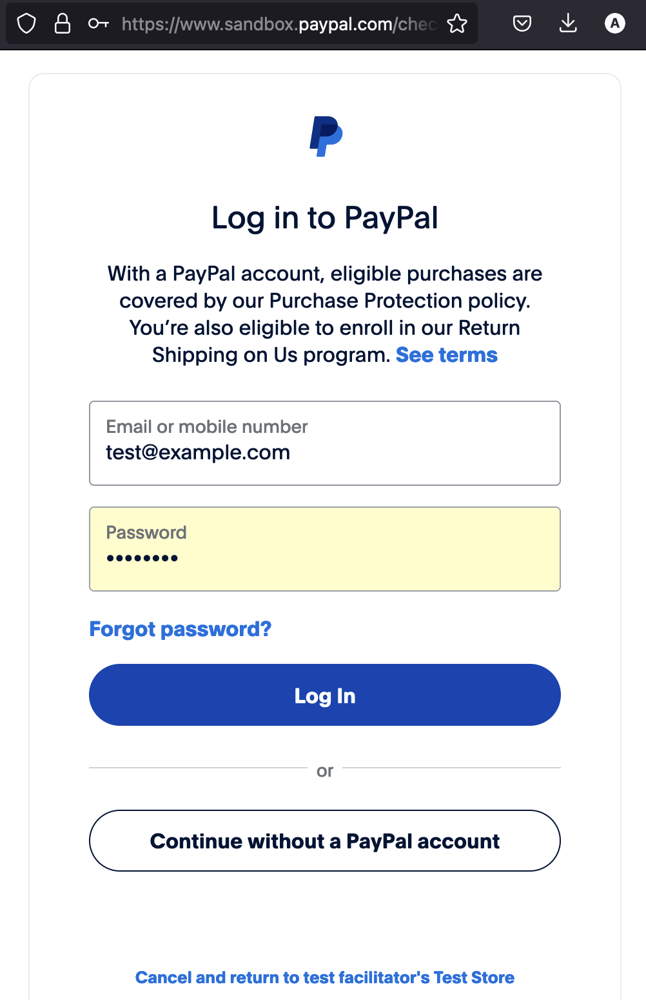
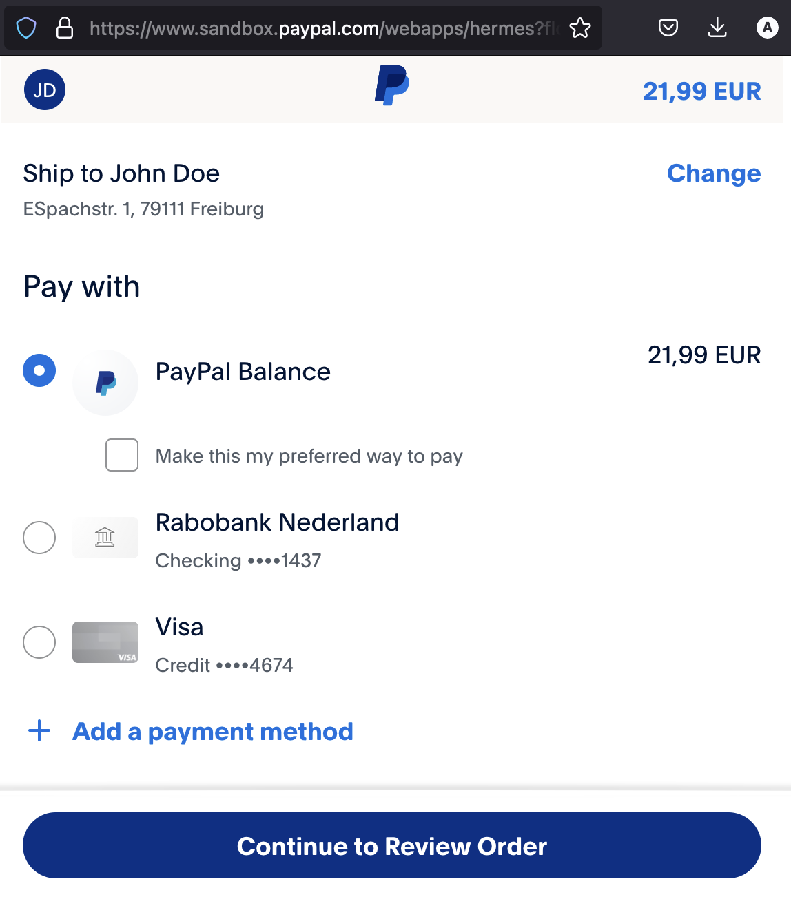
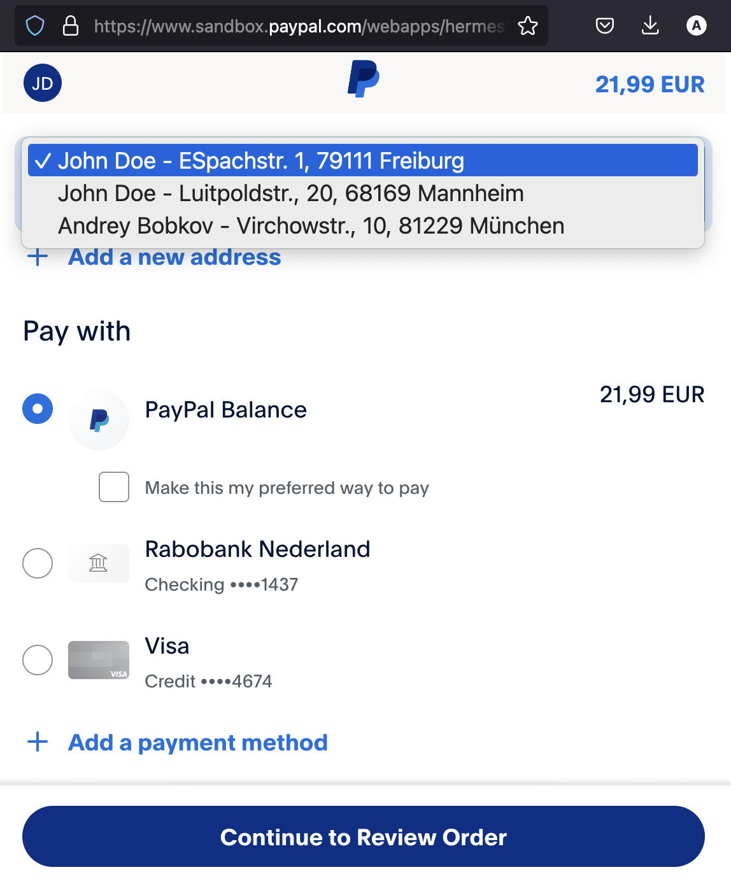

## PayPal Express Checkout Solution for Computop Node.js API

It's a common knowledge, that increasing of conversion rate is an evergreen goal of the most e-commerce shops in the world.  
One of the means to increase conversion rate is to use fast and reliable checkout process in the shop.  
The ideal checkout would be something like "Click, click, sold!"  
In this publication I will show you a working example, how to implement it on the base of PayPal Express Checkout with the use of Computop Node.js API.  
A working solution with open source code, installation instruction and explained test run is demonstrated.  
Possible future steps are considered. Your feedback is appreciated.  

Andrey Bobkov, 2024,   🗃️️ [https://github.com/a-bobkov](https://github.com/a-bobkov),   🔗 [https://www.linkedin.com/in/andreybobkov/](https://www.linkedin.com/in/andreybobkov/)

---
### Table of contents
🚅️ [Express Checkout](#-express-checkout)  
📲 [Suggested approach](#-suggested-approach)  
🔳 [Solution requirements](#-solution-requirements)  
📐 [Solution design](#-solution-design)  
🚀 [Solution test launch](#-solution-test-launch)  
🔧️ [Possible future steps](#-possible-future-steps)  
🍻 [Feedback options](#-feedback-options)  
📒 [Other investigations](#-other-investigations)  

## 🚅️  Express Checkout

Usual checkout process in a regular internet-shop is following - enter e-mail address and confirm it, enter name, enter postal address. Sometimes a phone number is required as well. Making the first purchase in a regular internet-shop, customers have to enter much data, that is especially stressful if their way of live not includes entering data into computer. That's why customers usually prefer shops, where they already bought something - just to avoid this tedious entering and re-checking all the data again. What can a regular internet-shop do with it, to help a customer make his first purchase? Implement an express checkout scenario!

[PayPal Express Checkout](https://www.paypal.com/mu/webapps/mpp/express-checkout) is an example of express checkout scenario for e-commerce. That becoming more and more popular scenario provides customers a faster way to make a purchase. The root idea behind the scenario is the following - if a customer wants to pay with PayPal and already has their shipping address in their PayPal account, no need to make them enter the address again in the shop. The shop could get the shipping address directly from the PayPal account of the customer, avoiding mistyping and saving customer's time.

<div align="center">
  
  <div>
    Picture 1. Simplified data flow with PayPal Express Checkout
  </div>
  <div>&nbsp;</div>
</div>

By the link above you could read about the PayPal Express Checkout solution in outline, I would not repeat it here.
But if we start thinking deeper, some questions could arise:
- what about e-mail address of the customer, can we get it from PayPal?
- what about phone number of the customer, can we get it from PayPal?
- what if we can not simply accept the address from PayPal, can we change it?

Below you will see in details, how the data is processed. Spoiler - yes we can, for all three questions!

## 📲  Suggested approach

I would suggest the following detailed checkout scenario with the use of PayPal Express Checkout:

1. Customer picks up articles into the shopping cart and clicks the button `PayPal Express Checkout`.
2. A regular PayPal login form is opened, customer logs in, sees total price of the purchase and the default shipping address. The difference with a regular PayPal payment interface here is that customer can not only accept the default shipping address, but has an option to select another one from the list of addresses, previously used in the PayPal account.
3. Clicking the button `Continue to Review Order` in the PayPal form the customer is returned back to the shop. At the moment the shop receives from the PayPal the customer's e-mail address, phone number and the selected shipping address and verifies it.
4. If the received shipping address is not clear enough for the shop, it should be displayed in the shop address page, so that customer could change or simply confirm it. Same for the phone number.
5. Anyway shop accepts the address, creates the order and completes the payment, sending to PayPal the order number and the possibly changed shipping address. The address is saved in the PayPal account so that next time the customer could select it for shipping.
6. In my opinion, at the moment the shop has a great opportunity to motivate the customer to create a personal account in the shop on the base of the data, used for the purchase. That could improve customer retention at low cost.

<div align="center">
  
  <div>
    Picture 2. Detailed data flow with PayPal Express Checkout
  </div>
  <div>&nbsp;</div>
</div>

Let's see, how close we are to the goal "Click, click, sold!" here.  
In the shopping cart customer clicks the button `PayPal Express Checkout` - this is the first necessary click.  
Optional: Customer sometimes should log in to PayPal account.  
Optional: Customer could select another shipping address.  
Customer have to confirm purchase in the PayPal account - this is the second necessary click.  
Optional: If the selected address is not clear for the shop, customer have to fix it.  

So if a customer is already logged into PayPal account and has a clear default shipping address, they can buy literally with two clicks!  
But that would be too optimistic - usually customer not uses PayPal so often to be logged in and has to click to log in.  
So really customer will most probably need 3 clicks to make a first purchase with PayPal Express Checkout. Not ideal, but much-much better than before!  

Let's see now, how such a solution could be implemented from the technological point of view.

## 🔳  Solution requirements

If a shop should support not only PayPal, but various payment technologies, it probably uses a [payment service provider](https://en.wikipedia.org/wiki/Payment_service_provider). Such a provider gives to the shop integration of all payments in one place. If a shop wants to implement PayPal Express Checkout and uses a payment service provider, it should be done via the provider.

One of the very first payment service providers in Germany is [Computop](https://computop.com).
Their API supports PayPal Express Payment and the demonstrated solution will use their [Computop API for Node.js](https://www.npmjs.com/package/computop-node-client).

<div align="center">
  
  <div>
    Picture 3. Payment Service Provider
  </div>
  <div>&nbsp;</div>
</div>

The [documentation provided by Computop](https://developer.computop.com/display/EN/PayPal+V2+REST) sometimes is not so evident as we would like to have. So the goal of this solution is to give to developer a possibility to observe, how the API really works in case of PayPal Express Checkout, what could be the really working examples of the input and output data.

## 📐  Solution design

The solution is stored in the GitHub public repository [https://github.com/a-bobkov/paypal-express-checkout-computop-solution](https://github.com/a-bobkov/paypal-express-checkout-computop-solution).

The core part of the solution is file `testPaypalExpressCheckoutComputopSolution.js` - a single JavaScript file, implementing the following steps:

1️⃣  Step `startPaypalExpressCheckoutComputop` takes shopping cart, sends it to Computop, waits for customer action, and receives customer's e-mail address, phone number and the selected shipping address:
1. Sub-step `prepareStartUrl` - takes shopping cart and prepares url for https-request to Computop.
2. Sub-step `requestStart` - takes the url and opens a browser window with PayPal, then creates a secure http server, that catches and returns the call back url after customer action in the opened browser window.
3. Sub-step `decodeStartCallbackUrl` - takes the call back url, decodes and verifies data from it.

2️⃣  Step `completePaypalExpressCheckoutComputop` - takes order number and possibly changed shipping address, sends them to Computop and without customer action receives the PayPal confirmation of payment:
1. Sub-step `prepareCompleteUrl` - takes order number and possibly changed shipping address and prepares url for https-request to Computop.
2. Sub-step `requestComplete` - sends the request to Computop and receives the response.
3. Sub-step `decodeCompleteResponse` - takes the response data, decodes and verifies them.

Let's observe now a test run of the solution.

## 🚀  Solution test launch

### ⚙️  Setup

The following setup guide assumes, that you already have a test Merchant ID from Computop and has connected your PayPal sandbox test business (merchant) account to it according to the [Computop guide for PayPal](https://developer.computop.com/display/EN/PayPal+V2+REST#PayPalV2REST-ConfigurationforPayPal).

1️⃣  Clone the repository:

```shell
git clone https://github.com/a-bobkov/paypal-express-checkout-computop-solution.git
```

2️⃣  Install dependencies:

```shell
cd paypal-express-checkout-computop-solution && npm i
```

3️⃣  Install `mkcert`

[mkcert](https://github.com/FiloSottile/mkcert) is a simple zero-config tool for making locally-trusted development certificates (don't be confused with self-signed certificates). The certificate is necessary for the demonstration to create a secure http server, that can be called back from the script in browser window. Please find and use the [installation instruction](https://github.com/FiloSottile/mkcert?tab=readme-ov-file#installation) for your operating system.

4️⃣  Create a new local CA [(Certificate Authority)](https://en.wikipedia.org/wiki/Certificate_authority), that is needed to issue and verify development certificates:

```shell
mkcert -install
```

5️⃣  Export the root CA location for Node.js so that a running Node.js could find it:

```shell
export NODE_EXTRA_CA_CERTS="$(mkcert -CAROOT)/rootCA.pem"
```

6️⃣  Generate locally-trusted development certificate, to be used by the secure http server, that will be created by the demonstrated solution:

```shell
mkdir certificate && cd certificate && mkcert localhost && cd ..
```

7️⃣  Create a `.env` file and populate it manually with your test credentials, received from Computop:

```shell
cat <<EOF >.env
MERCHANT_ID=
KEY_BLOWFISH=
KEY_HMAC=
EOF
```

A NOT working example, how the ready to use file with your test credentials should look like:
```dotenv
MERCHANT_ID=IC_010441
KEY_BLOWFISH=6d_Q)4WbD!o5z8]P
KEY_HMAC=pL!97tK?N)z38E]cYm2*(4DyjW_5B6b=
```

### 🛰️  Test launch

1️⃣  Run the test in a terminal window:

```shell
node testPaypalExpressCheckoutComputopSolution.js
```

Now a default browser window with PayPal test environment (sandbox) login should appear.

<div align="center">
  <kbd>
    
  </kbd>
  <div>
    Picture 4. PayPal sandbox login
  </div>
  <div>&nbsp;</div>
</div>

2️⃣  Enter your test personal PayPal sandbox credentials - email and password.

Now a PayPal Express Checkout form should appear.

<div align="center">
  <kbd>
    
  </kbd>
  <div>
    Picture 5. PayPal Express Checkout form
  </div>
  <div>&nbsp;</div>
</div>

3️⃣  Change the shipping address on the top of the form

<div align="center">
  <kbd>
    
  </kbd>
  <div>
    Picture 6. PayPal Express Checkout form with address list
  </div>
  <div>&nbsp;</div>
</div>

4️⃣  Click the button `Continue to Review Order`.

Now the PayPal should go away and instead the following text message should appear: `The tab is not needed any more. Please close the tab manually!` You may close the browser tab now or later - it does not matter.

5️⃣  Go back to the terminal and see the logs.

The following description explains the most important parts of the log.

First of all we are assuming, that customer decided to buy 2 "Tee spoon" with SKU "2894323-00011" for the total cost of 21,99 EUR.

The parameters for the PayPal Express Checkout Computop start url are the following:
```json
{
  "TransID": "2a8fd193977e8e1bab618eedb5e25b0f",
  "PayPalMethod": "shortcut",
  "Capture": "Auto",
  "URLSuccess": "https://localhost:3000/computop-pay-pal-success",
  "URLFailure": "https://localhost:3000/computop-pay-pal-failure",
  "URLNotify": "https://localhost:3000/computop-pay-pal-notify",
  "Response": "encrypt",
  "OrderDesc": "Name:Tee-spoon-Sku:2894323-00011-Quantity:2",
  "Currency": "EUR",
  "Amount": "2199",
  "TaxTotal": "351",
  "ItemTotal": "1848",
  "shAmount": "0",
  "Mac": "F023B0A0E4AFAA891DBB6DA7AC0D1A5184DC5490E0736BF9D404F629ED9BC989"
}
```

At this point a browser window with PayPal has been opened automatically, you logged into your test personal PayPal sandbox account, checked amount to pay, optionally selected another shipping address and confirmed the payment.

After the customer confirmation the local secure http-server receives request with the shipping address `John Doe, Luitpoldstr., 20 Mannheim 68169`. At this point an open payments in both PayPal and Computop accounts are created, but money transfer is not yet performed.

The decoded PayPal Express Checkout Computop call back url:
```json
{
  "mid": "IC_010441",
  "PayID": "cec9ee1a7f0f4abfbc088bc0cd790b65",
  "TransID": "2a8fd193977e8e1bab618eedb5e25b0f",
  "Status": "AUTHORIZE_REQUEST",
  "XID": "1d6b7d79e40644129472aea52b499226",
  "Code": "00000000",
  "Description": "REQUEST",
  "name": "John Doe",
  "AddrStreet": "Luitpoldstr., 20",
  "addrstreet2": "",
  "AddrCity": "Mannheim",
  "AddrZip": "68169",
  "AddrCountryCode": "DE",
  "Phone": "+49 7999424197",
  "e-mail": "test@example.de",
  "firstname": "test",
  "lastname": "buyer",
  "mac": "80D10C23C808FFD178027C80328D739878E3EBBBEB3A4F9D5228FA88325D2EB3"
}
```

Now we want to send to Computop the order reference and another shipping address, that we decided to use for this purchase.

The parameters for PayPal Express Checkout Computop complete url are the following:
```json
{
  "Response": "encrypt",
  "PayID": "cec9ee1a7f0f4abfbc088bc0cd790b65",
  "TransID": "2a8fd193977e8e1bab618eedb5e25b0f",
  "Amount": "2199",
  "Currency": "EUR",
  "FirstName": "Andrey",
  "LastName": "Bobkov",
  "AddrStreet": "St.-Martin-Straße 102",
  "AddrStreet2": "c/o Mediawave",
  "AddrCity": "München",
  "AddrZip": "81669",
  "AddrCountryCode": "DE",
  "RefNr": "DE--099222773",
  "Mac": "C6E7E0179E4F2119A3941FBAF37D8B745DDA2C1F54F1FBF09A7584E73D15FD71"
}
```

In the response to the above request we receive the confirmation, that the payment is completed successfully.

Decoded PayPal Express Checkout Computop complete response:
```json
{
  "Mid": "IC_010441",
  "PayID": "cec9ee1a7f0f4abfbc088bc0cd790b65",
  "TransID": "2a8fd193977e8e1bab618eedb5e25b0f",
  "Status": "OK",
  "XID": "1d6b7d79e40644129472aea52b499226",
  "Code": "00000000",
  "Description": "success",
  "RefNr": "DE--099222773"
}
```

Money transfer is performed at this point. Both payments in Computop and PayPal accounts are closed now.

I hope, the above explanation helps any interested developer to understand, how the Computop Node.js API really works in case of PayPal Express Checkout.

## 🔧️  Possible future steps

With the demonstrated solution an e-commerce developer could fast and easy investigate various "what if" scenarios, playing with parameters of the Computop API for PayPal Express Checkout, analysing the service responses and the corresponding results in both Computop and PayPal accounts.

The solution could be expanded to cover other payment scenarios, provided by Computop.

The demonstrated approach could be used to implement similar solutions for other Payment Service Providers.

Since the solution is not dependent on any Node.js framework, a developer could easily adopt this solution to any Node.js common use framework of their choice.

## 🍻  Feedback options

Your verbal opinion is appreciated via:

🔗  [The LinkedIn post](https://www.linkedin.com/posts/andreybobkov_ecommerce-paymentintegration-paypal-activity-7173280514072657920-0uIa)

🗃️️  [The Repository Discussions](https://github.com/a-bobkov/paypal-express-checkout-computop-solution/discussions),

🗃️️  [The Repository Issues](https://github.com/a-bobkov/paypal-express-checkout-computop-solution/issues)

To keep my motivation high, you may

Star ⭐ the [GitHub public repository PayPal-Express-Checkout-Computop-Solution ](https://github.com/a-bobkov/paypal-express-checkout-computop-solution)

[](https://www.paypal.com/donate/?hosted_button_id=MYA8VXRL7Q4ZE)

## 📒  Other investigations

If you are interested to see my other published investigations, you may find the list here: [https://a-bobkov.github.io/](https://a-bobkov.github.io/)
